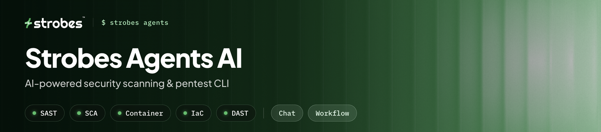
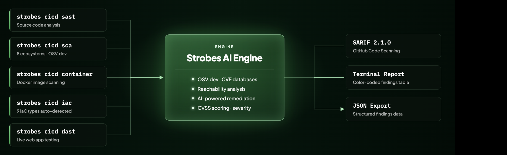

<p align="center">
  
</p>

A local, terminal-native client for **Strobes Agents AI**. It connects to a
remote Strobes organization over MasterKey auth, streams agent runs live in a
clean terminal UI, runs the sandbox (shell) and browser on your local machine —
and ships a self-contained **CI scanning suite** (SAST · SCA · Container · IaC ·
DAST) that works without any extra services.

<p align="center">
  
</p>

> **Security:** no credentials are committed to this repo. You provide your own
> MasterKey at runtime (env vars or interactive `login`); it's stored 0600 under
> your platform config dir and is git-ignored.

## Install

Prebuilt binaries for every platform are published on
[**Releases**](../../releases/latest). Pick the one-liner for your OS:

### macOS / Linux — one-liner

```bash
curl -fsSL https://raw.githubusercontent.com/strobes-co/strobes-agents-cli/main/install.sh | bash
```

This also installs the **sandbox pack**: bundled security tools (`nuclei`, `httpx`,
`subfinder`, `dnsx`, `ffuf`, `gobuster`, `nmap`) and a standalone Python with the
agent packages baked in. Agent commands run with these on PATH, so a fresh machine
behaves like the cloud sandbox — no Docker, no root, no system Python.

```bash
strobes pack                 # where it is, and which interpreter the agent uses
strobes pack --install       # (re)install it
STROBES_SKIP_PACK=1 …| bash  # binary only
```

The pack is shared with the Strobes bridge — if you already run
`strobes-shell-agent` on this machine, the CLI uses the pack that is already
there rather than downloading a second copy. Without a pack everything still
works; the agent just falls back to whatever tools the host has.


```bash
curl -fsSL https://raw.githubusercontent.com/strobes-co/strobes-agents-cli/main/install.sh | bash
```

<details>
<summary>or, without the install script (pure curl):</summary>

```bash
OS=$(uname -s); ARCH=$(uname -m); case "$OS-$ARCH" in
  Darwin-arm64)  T=aarch64-apple-darwin ;;
  Darwin-x86_64) T=x86_64-apple-darwin ;;
  Linux-x86_64)  T=x86_64-unknown-linux-gnu ;;
  Linux-aarch64) T=aarch64-unknown-linux-gnu ;;
  *) echo "unsupported platform: $OS-$ARCH" >&2; exit 1 ;;
esac
curl -fsSL "https://github.com/strobes-co/strobes-agents-cli/releases/latest/download/strobes-$T.tar.gz" \
  | tar -xz && sudo install -m755 "strobes-$T/strobes" /usr/local/bin/strobes && rm -rf "strobes-$T"
strobes --version
```
</details>

### Windows (PowerShell) — one-liner

```powershell
$ErrorActionPreference='Stop'; $T='x86_64-pc-windows-msvc'; $dst="$env:LOCALAPPDATA\Programs\strobes"; `
New-Item -ItemType Directory -Force $dst | Out-Null; `
Invoke-WebRequest "https://github.com/strobes-co/strobes-agents-cli/releases/latest/download/strobes-$T.tar.gz" -OutFile "$env:TEMP\strobes.tgz"; `
tar -xzf "$env:TEMP\strobes.tgz" -C $env:TEMP; Copy-Item "$env:TEMP\strobes-$T\strobes.exe" "$dst\strobes.exe" -Force; `
[Environment]::SetEnvironmentVariable('Path',$env:Path+";$dst",'User'); `
Write-Host "installed to $dst\strobes.exe — open a new terminal, then run: strobes --help"
```

### Platform binaries

| Platform | Asset |
|----------|-------|
| macOS (Apple Silicon) | `strobes-aarch64-apple-darwin.tar.gz` |
| macOS (Intel) | `strobes-x86_64-apple-darwin.tar.gz` |
| Linux (x86-64) | `strobes-x86_64-unknown-linux-gnu.tar.gz` |
| Windows (x86-64) | `strobes-x86_64-pc-windows-msvc.tar.gz` |

Each ships with a `.sha256` checksum. Verify with
`shasum -a 256 -c <file>.sha256` (macOS) or `sha256sum -c <file>.sha256` (Linux).

### Build from source

```bash
cargo build --release        # → target/release/strobes
cp target/release/strobes /usr/local/bin/
```

Requirements: **Rust** (`rustup`). Chrome/Chromium is optional — only needed
for the `browser_*` tools in chat and DAST scanning.

## Configure

Get a MasterKey from **Strobes UI → Organization → API access**:

```bash
export STROBES_AI_BASE_URL=https://app.strobes.co     # your deployment
export STROBES_AI_ORG_ID=<ORG_UUID>
export STROBES_AI_MASTER_KEY=<40-char-hex-key>
```

These persist to `~/.config/strobes-ai/config.json`
(`~/Library/Application Support/strobes-ai/config.json` on macOS).

> The API path prefix defaults to `/api/v1` (nginx/ALB-fronted deployments).
> Only if you hit Django directly (no proxy) set `STROBES_AI_DEPLOYMENT=direct`.

---

## `strobes ci` — Security Scanning Suite

<p align="center">
  
</p>

`strobes ci` is a self-contained security scanning engine built into the CLI.
It runs five scan types — source code, dependencies, container images,
infrastructure-as-code, and live web targets — and sends raw findings to
Strobes AI for reachability analysis and remediation guidance. All outputs are
**SARIF 2.1.0** compatible for GitHub Code Scanning and other CI platforms.

```bash
strobes ci sast .                          # static code analysis
strobes ci sca .                           # software composition analysis
strobes ci container nginx:1.24            # Docker image CVE scan
strobes ci iac ./infra                     # IaC misconfiguration scan
strobes ci dast https://staging.myapp.com  # live web app testing
```

### `strobes ci sast` — Static Application Security Testing

Copies the source tree into a local sandbox, prompts the AI to analyze it for
injection flaws, auth issues, secrets, and unsafe patterns, and streams findings
with severity and fix guidance.

```bash
strobes ci sast .
strobes ci sast ./src --output sarif -o sast.sarif
strobes ci sast ~/myapp --fail-on high --timeout 600
strobes ci sast . --exclude "*.lock" --exclude "vendor/**" --max-mb 200
```

| Flag | Default | Description |
|------|---------|-------------|
| `<dir>` | `.` | Directory to scan |
| `--output` | `text` | Output format: `text`, `json`, `sarif` |
| `-o / --output-file` | — | Save results to a file |
| `--fail-on <SEVERITY>` | — | Exit 1 if any finding ≥ severity (`critical` / `high` / `medium` / `low`) |
| `--exclude <GLOB>` | — | Exclude file patterns (repeatable); `node_modules`, `.git`, binaries always excluded |
| `--max-mb <MB>` | `100` | Maximum sandbox size in MB |
| `--prompt <TEXT>` | — | Override the default SAST prompt |
| `--timeout <SECS>` | `600` | Abort if the AI has not finished |

---

### `strobes ci sca` — Software Composition Analysis

Parses all manifest and lock files in the directory, queries **OSV.dev** for
known CVEs (no API key required), builds the full transitive dependency graph,
then uses AI to determine which vulnerabilities are actually reachable in your
code — so only real risk is surfaced.

```bash
strobes ci sca .
strobes ci sca ~/myapp --output sarif -o sca.sarif
strobes ci sca . --skip-ai --min-severity medium
strobes ci sca . --fail-on high
```

**Supported ecosystems:**

| Language | Files parsed |
|----------|-------------|
| Python | `requirements.txt`, `Pipfile.lock`, `poetry.lock`, `pyproject.toml` |
| Node.js | `package-lock.json`, `yarn.lock`, `pnpm-lock.yaml` |
| Go | `go.sum`, `go.mod` |
| Rust | `Cargo.lock` |
| Ruby | `Gemfile.lock` |
| PHP | `composer.lock` |
| Java | `pom.xml` (Maven), `build.gradle` |
| .NET | `*.csproj`, `packages.lock.json`, `*.deps.json` |

| Flag | Default | Description |
|------|---------|-------------|
| `<dir>` | `.` | Directory to scan |
| `--output` | `text` | Output format: `text`, `json`, `sarif` |
| `-o / --output-file` | — | Save results to a file |
| `--fail-on <SEVERITY>` | — | Exit 1 if any finding ≥ severity |
| `--min-severity` | `low` | Minimum severity to include |
| `--skip-ai` | — | Skip AI reachability; report every CVE from OSV.dev |
| `--timeout <SECS>` | `600` | Abort AI analysis after this many seconds |

---

### `strobes ci container` — Docker Image Scanning

Pulls the image, creates a temporary container to extract the OS package
database (dpkg/apk) and any app-level manifests, queries OSV.dev for CVEs,
then uses AI reachability analysis. **Requires Docker.**

```bash
strobes ci container nginx:1.24
strobes ci container python:3.9-slim --skip-ai
strobes ci container myapp:latest --fail-on critical
strobes ci container ubuntu:20.04 --output sarif -o container.sarif
strobes ci container myapp:latest --platform linux/amd64
```

**Supported base images:** Debian/Ubuntu (dpkg), Alpine (apk), plus any
app-level language manifests found on the image filesystem.

| Flag | Default | Description |
|------|---------|-------------|
| `<image>` | — | Docker image to scan (e.g. `nginx:1.24`, `myapp:latest`) |
| `--output` | `text` | Output format: `text`, `json`, `sarif` |
| `-o / --output-file` | — | Save results to a file |
| `--fail-on <SEVERITY>` | — | Exit 1 if any finding ≥ severity |
| `--min-severity` | `low` | Minimum severity to include |
| `--skip-ai` | — | Skip AI analysis; report all CVEs directly |
| `--platform <PLATFORM>` | — | Target platform for multi-arch images (e.g. `linux/amd64`) |
| `--timeout <SECS>` | `600` | Abort AI analysis after this many seconds |

---

### `strobes ci iac` — Infrastructure-as-Code Scanning

Auto-detects all IaC files in the directory tree (by filename, extension, and
content sniffing), copies only those files into a sandbox, and uses AI to find
real misconfigurations — privilege escalation, open ports, missing encryption,
insecure defaults, and more.

```bash
strobes ci iac .
strobes ci iac ./infra --output sarif -o iac.sarif
strobes ci iac . --fail-on high
strobes ci iac . --only terraform --only kubernetes
```

**Supported IaC types:**

| Type | Files detected |
|------|---------------|
| Terraform | `*.tf`, `*.tfvars` |
| CloudFormation | `template.yaml`, `cloudformation*.yml`, SAM templates |
| Kubernetes | Pod, Deployment, Service, Ingress, Role, RBAC manifests |
| Helm | `Chart.yaml`, `values.yaml` + `templates/*.yaml` |
| Dockerfile | `Dockerfile`, `Dockerfile.*` |
| Docker Compose | `docker-compose.yml`, `docker-compose.yaml`, `compose.yaml` |
| GitHub Actions | `.github/workflows/*.yml` |
| Ansible | `playbook.yml`, `site.yml`, role `tasks/main.yml` |
| ARM Templates | `azuredeploy.json`, ARM JSON with `$schema` |

| Flag | Default | Description |
|------|---------|-------------|
| `<dir>` | `.` | Directory to scan |
| `--output` | `text` | Output format: `text`, `json`, `sarif` |
| `-o / --output-file` | — | Save results to a file |
| `--fail-on <SEVERITY>` | — | Exit 1 if any finding ≥ severity |
| `--only <TYPE>` | — | Restrict to one IaC type (repeatable). Values: `terraform`, `cloudformation`, `kubernetes`, `helm`, `dockerfile`, `compose`, `github-actions`, `ansible`, `arm` |
| `--timeout <SECS>` | `600` | Abort after this many seconds |

---

### `strobes ci dast` — Dynamic Application Security Testing

Actively probes a live URL via HTTP requests, browser navigation, and fuzzing.
No files are copied — the target must be reachable from this machine.

```bash
strobes ci dast http://localhost:5000
strobes ci dast https://staging.myapp.com --output sarif -o dast.sarif
strobes ci dast http://app.local --cookie "session=abc123" --fail-on high
strobes ci dast http://app.local --scope /api --scope /admin
strobes ci dast https://app.com --bearer "$TOKEN"
```

| Flag | Default | Description |
|------|---------|-------------|
| `<url>` | — | Target base URL to scan (required) |
| `--output` | `text` | Output format: `text`, `json`, `sarif` |
| `-o / --output-file` | — | Save results to a file |
| `--fail-on <SEVERITY>` | — | Exit 1 if any finding ≥ severity |
| `--cookie <COOKIE>` | — | Cookie header value for all requests (e.g. `session=abc; csrf=xyz`) |
| `--bearer <TOKEN>` | — | Bearer token for `Authorization` header |
| `--scope <PATH>` | — | Restrict crawl + testing to this path prefix (repeatable) |
| `--prompt <TEXT>` | — | Override the default DAST prompt |
| `--timeout <SECS>` | `900` | Abort if the scan has not finished |

---

### CI Integration

All scan types share a common set of CI-friendly features:

- **SARIF 2.1.0** output (`--output sarif`) — upload to GitHub Code Scanning,
  GitLab SAST, or any SARIF-aware platform
- **Exit-code gating** (`--fail-on <SEVERITY>`) — exit 1 when findings meet or
  exceed the threshold; exit 0 when clean
- **File output** (`-o <FILE>`) — write results to disk for artifact upload

```yaml
# .github/workflows/security.yml
name: Security scan
on: [push, pull_request]
jobs:
  sca:
    runs-on: ubuntu-latest
    steps:
      - uses: actions/checkout@v4
      - name: Install strobes
        run: curl -fsSL https://raw.githubusercontent.com/strobes-co/strobes-agents-cli/main/install.sh | bash
      - name: SCA — dependency scan
        env:
          STROBES_AI_BASE_URL:   ${{ secrets.STROBES_BASE_URL }}
          STROBES_AI_ORG_ID:     ${{ secrets.STROBES_ORG_ID }}
          STROBES_AI_MASTER_KEY: ${{ secrets.STROBES_MASTER_KEY }}
        run: strobes ci sca . --output sarif -o sca.sarif --fail-on critical
      - uses: github/codeql-action/upload-sarif@v3
        if: always()
        with:
          sarif_file: sca.sarif
  iac:
    runs-on: ubuntu-latest
    steps:
      - uses: actions/checkout@v4
      - name: Install strobes
        run: curl -fsSL https://raw.githubusercontent.com/strobes-co/strobes-agents-cli/main/install.sh | bash
      - name: IaC scan
        env:
          STROBES_AI_BASE_URL:   ${{ secrets.STROBES_BASE_URL }}
          STROBES_AI_ORG_ID:     ${{ secrets.STROBES_ORG_ID }}
          STROBES_AI_MASTER_KEY: ${{ secrets.STROBES_MASTER_KEY }}
        run: strobes ci iac . --output sarif -o iac.sarif --fail-on high
      - uses: github/codeql-action/upload-sarif@v3
        if: always()
        with:
          sarif_file: iac.sarif
```

---

## Interactive Chat (`strobes chat`)

Opens a full terminal UI that streams a remote agent run and executes
its tools (shell, code, browser) on your local machine.

```bash
strobes status                  # check connectivity
strobes workspaces              # list remote workspaces
strobes threads                 # list your threads
strobes chat                    # interactive chat (thread picker)
strobes chat --thread <UUID> --model 18    # resume a thread (Sonnet 4.6)
strobes bind --download         # pick + download a workspace locally
strobes pull --workspace <UUID> # download workspace files to a folder
strobes export -w <UUID>        # export thread transcripts (Markdown + index.md)
strobes export -w <UUID> --format json --dir out/   # raw event JSON
strobes update                  # self-update to the latest release
strobes --version               # print the version
```

### In-chat keys

| Key | Action |
|-----|--------|
| `Enter` | Send message |
| `/` | Slash-command autocomplete (Tab/Enter to complete) |
| `^W` | Workspaces browser → Enter binds, then pick a thread |
| `^O` | Threads browser (Enter switches) |
| `^F` / `^A` | Findings / approvals for the bound workspace |
| `^L` | List synced local workspace files |
| `^E` | Open the local workspace folder in Finder / Explorer |
| `^Y` | Copy the full transcript to the clipboard |
| `^T` / `^R` | Toggle thinking / markdown |
| `^C` | Cancel the running turn (or quit when idle) |
| `Esc` | Back (chat → threads → workspaces) · PgUp/PgDn / ↑↓ scroll |

Mouse isn't captured, so terminal native **click-drag selection + copy** still
works in the transcript. A spinner appears while a turn is running. The CLI
checks for newer releases on chat start and suggests the update one-liner.

**Browser setup:** `browser_*` tools need Google Chrome / Chromium — detected
automatically. Point at a non-standard install with `STROBES_AI_CHROME=/path/to/chrome`,
or set `STROBES_AI_BROWSER_AUTOINSTALL=1` to download Chrome for Testing on first use.

**Browser isolation:** parallel agents each get their own CDP tab within a
shared Chrome process per workspace.

**Model picker ids:** `4` Haiku 4.5 · `18` Sonnet 4.6 · `21` Opus 4.7
(Bedrock), or your org's BYOM id.

### Credits & tokens

The status bar shows **AI credits + token usage**: the current run's usage
while streaming (`◈ 0.036 cr · 1.8k tok`), and the session total (`◈ Σ …`)
once idle.

---

## Workflows (`strobes workflow`)

Workflows are multi-phase, multi-agent security playbooks that run **entirely on
the Strobes cloud**. The CLI does not orchestrate anything locally — it attaches
a workflow *template* to a workspace, tells the cloud to run it, then acts as a
live client: a TUI that streams every running task's output in real time and
lets you pause / resume / restart / cancel the run.

```bash
# See the templates your org has (built-in + custom:)
strobes workflow templates

# Attach a template to a workspace, start it in the cloud, and open the
# live streaming TUI. Prompts for the workspace and any required variables.
strobes workflow attach --template web-pentest -v TARGET=https://example.com

# Start it in CI without a TUI (fire-and-forget; poll status separately)
strobes workflow attach --template web-pentest -v TARGET=https://example.com --no-watch

# Re-open the live TUI for a workspace whose workflow is already running
strobes workflow watch --workspace <workspace-id>

# One-shot text status (scriptable)
strobes workflow status --workspace <workspace-id>
```

### The live TUI

`attach` (without `--no-watch`) and `watch` open the same view:

- **left** — the phase / task tree, updated from a 2s status poll
- **right** — details for the selected item, and for a *running* task the agent's
  live token / tool-call output, streamed over a pulse WebSocket to that task's
  thread (marked `● live`)
- **keys** — `↑↓` navigate · `Enter` open the task thread as a full chat ·
  `p` pause · `r` resume · `s` restart · `d` detach · `q` quit

### Workflow commands

| Command | What it does |
|---------|--------------|
| `strobes workflow templates` | List available templates (built-in and `custom:`) |
| `strobes workflow attach [--workspace W] [--template SLUG] [-v K=V…] [--no-watch]` | Attach a template, start it in the cloud, open the live TUI |
| `strobes workflow watch [--workspace W]` | Open the live streaming TUI for a running workflow |
| `strobes workflow status [--workspace W]` | Print the current workflow status |
| `strobes workflow pause \| resume \| cancel [--workspace W]` | Control a running workflow |
| `strobes workflow restart [--workspace W] [--from-phase KEY]` | Restart from the start or a phase |
| `strobes workflow advance [--workspace W]` | Advance past a manual-gate phase |
| `strobes workflow detach [--workspace W] [-y]` | Cancel + remove the workflow from a workspace |
| `strobes workflow save --workspace W --name NAME` | Save the running workflow as a reusable `custom:` template |
| `strobes workflow delete-template <custom:slug>` | Delete a custom template |

Templates (their phases, tasks and required variables) are authored and stored
on the server, so a workflow behaves identically no matter which machine drives
it — there are no local YAML files to keep in sync.


## How it maps to the backend

| CLI piece | Backend counterpart |
|-----------|---------------------|
| MasterKey auth (`Authorization: token …`, WS `?api_key=`) | `MasterKeyAuthentication`, `channels_middleware` |
| `chat` stream | `PulseConsumer` (`ws/<org>/pulse/<thread>/`) |
| local tools (shell / code / browser) | `LocalProxyTool` + `tool.local_execute` events |
| workspaces · threads · history · files · findings · approvals · slash-commands | `cli_views` REST (MasterKey) |
| workflow templates + control | `cli_views` workflow REST → `WorkflowEngine` (server-side execution) |
| live task output | one pulse connection per *running* task thread (`ws/<org>/pulse/<thread>/`) |

## Project layout

```
src/
  main.rs           clap commands + async entry point (ci scanning suite lives here)
  config.rs         profiles, secret storage, URL/path helpers
  api.rs            reqwest MasterKey REST client
  pulse.rs          pulse WebSocket client (flat StreamEvents, CLI_LOCAL tool dispatch)
  local.rs          local shell/code execution sandbox
  browser.rs        local Chrome automation (chromiumoxide); per-agent tab isolation
  markdown.rs       Markdown → ratatui Line renderer (headings, tables, code blocks)
  picker.rs         full-screen list selector widget
  app.rs            Ratatui chat app: transcript, overlays, slash popup, input, status
  remote_wf_tui.rs  Live cloud-workflow TUI: phase/task tree + per-task pulse
                    streaming (● live) + pause/resume/restart/detach controls

assets/
  banner.png        README header banner (hex logo + feature badges)
  ws-arch.svg       WebSocket architecture diagram
  ci-pipeline.png   CI scanning pipeline diagram
```

## Development

```bash
cargo test                      # unit tests
cargo run -- chat
cargo run -- ci sca .           # SCA scan of this repo
cargo run -- workflow templates       # list cloud workflow templates
```

## License

Proprietary — © Strobes Security.
